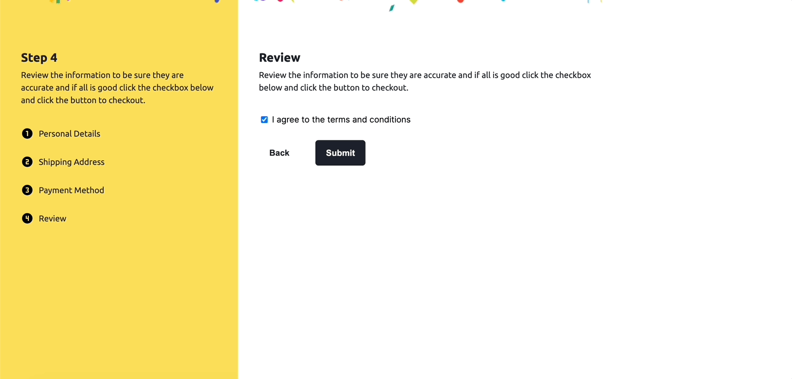
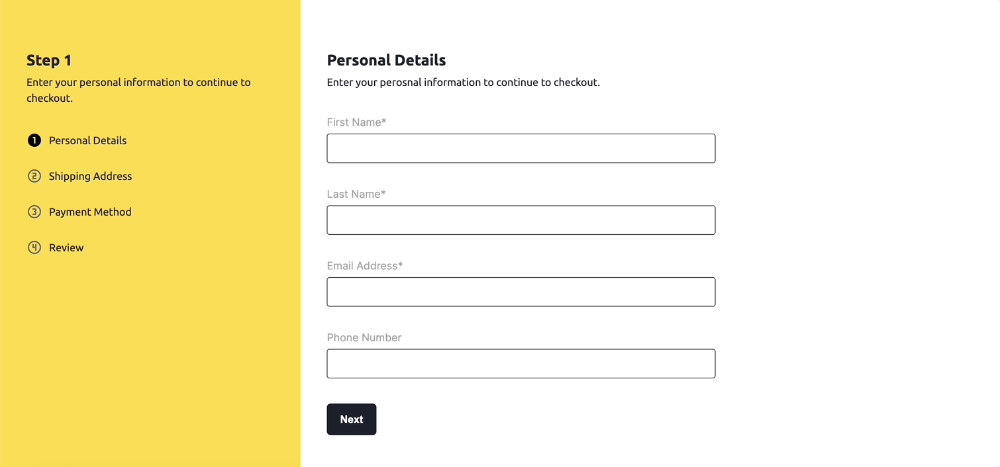

<div  align="center">

<h1>Nextjs Multi-Step Form Using Formik</h1>

<!-- Badges -->

<p>

<a  href="https://github.com/apettiigrew/nextjs-multi-step-form-with-formik/graphs/contributors">


</a>

<a  href="">


</a>

</p>

<h4>

[View Demo](https://nextjs-multi-step-form-with-formik-9cxg.vercel.app) <span> · </span> [Feature Request](https://github.com/apettiigrew/nextjs-multi-step-form-with-formik/issues/)
</h4>

</div>

<br  />

<!-- About the Project -->

  

## :star2: About the Project

  

In this project, we’ll build a checkout form. The form is going to have four steps. In the first step of the form, we’ll have fields for the user’s personal details. In the second step, we’ll include fields for the user’s shipping details. In the third step, we’ll have fields for the payment details. In the final step, we’ll include a checkbox field that the user needs to check to confirm if the information they supplied is accurate. The user interface design of all the steps in the form gives us the direction we need.

Your users should be able to:
-   Complete each step of the sequence
-   Go back to a previous step to update their selections
-   See a summary of their selections on the final step and confirm their order
-   Receive form validation messages if:
    -   A field has been missed
    -   The email address is not formatted correctly
    -   A step is submitted, but no selection has been made

  

In this project, we’ll build a checkout form. The form is going to have four steps. In the first step of the form, we’ll have fields for the user’s personal details. In the second step, we’ll include fields for the user’s shipping details. In the third step, we’ll have fields for the payment details. In the final step, we’ll include a checkbox field that the user needs to check to confirm if the information they supplied is accurate. The user interface design of all the steps in the form gives us the direction we need.

Your users should be able to:

- Complete each step of the sequence
- Go back to a previous step to update their selections
- See a summary of their selections on the final step and confirm their order
- Receive form validation messages if:
  - A field has been missed
  - The email address is not formatted correctly
  - A step is submitted, but no selection has been made

In this project, we’ll build a checkout form. The form is going to have four steps. In the first step of the form, we’ll have fields for the user’s personal details. In the second step, we’ll include fields for the user’s shipping details. In the third step, we’ll have fields for the payment details. In the final step, we’ll include a checkbox field that the user needs to check to confirm if the information they supplied is accurate. The user interface design of all the steps in the form gives us the direction we need.

Your users should be able to:

- Complete each step of the sequence
- Go back to a previous step to update their selections
- See a summary of their selections on the final step and confirm their order
- Receive form validation messages if:
  - A field has been missed
  - The email address is not formatted correctly
  - A step is submitted, but no selection has been made

<!-- Screenshots -->

  

### :camera: Screenshots

  





  

<!-- TechStack -->

  

### :space_invader: Tech Stack

  

<details>

<ul>

<li><a  href="https://www.typescriptlang.org/">Typescript</a></li>

<li><a  href="https://nextjs.org/">Next.js</a></li>

<li><a  href="https://reactjs.org/">React.js</a></li>

<li><a  href="https://sass-lang.com/">Sass</a></li>

</ul>

</details>

  

<!-- Env Variables -->

<!-- Getting Started -->

  

## :toolbox: Getting Started

  

<!-- Prerequisites -->

  

### :bangbang: Prerequisites

Install the following

- git

- nodejs

  

### :running: Run Locally

  

Clone the project

```bash

git  clone  git@github.com:apettiigrew/nextjs-multi-step-form-with-formik.git

```

  

Go to the project directory

  

```bash

cd  nextjs-multi-step-form-with-formik

```

  

Install dependencies

  

```bash

npm  install

```

  

Start the server

  

```bash

npm  run  dev

```

## :wave: Contributing

<a  href="https://github.com/apettiigrew/nextjs-multi-step-form-with-formik/graphs/contributors">


</a>

  

Contributions are always welcome!

  

<!-- Acknowledgments -->

  

## :gem: Acknowledgements

  

Use this section to mention useful resources and libraries that you have used in your projects.

  

- [Shields.io](https://shields.io/)

- [Awesome README](https://github.com/matiassingers/awesome-readme)

- [Emoji Cheat Sheet](https://github.com/ikatyang/emoji-cheat-sheet/blob/master/README.md#travel--places)

- [Readme Template](https://github.com/othneildrew/Best-README-Template)