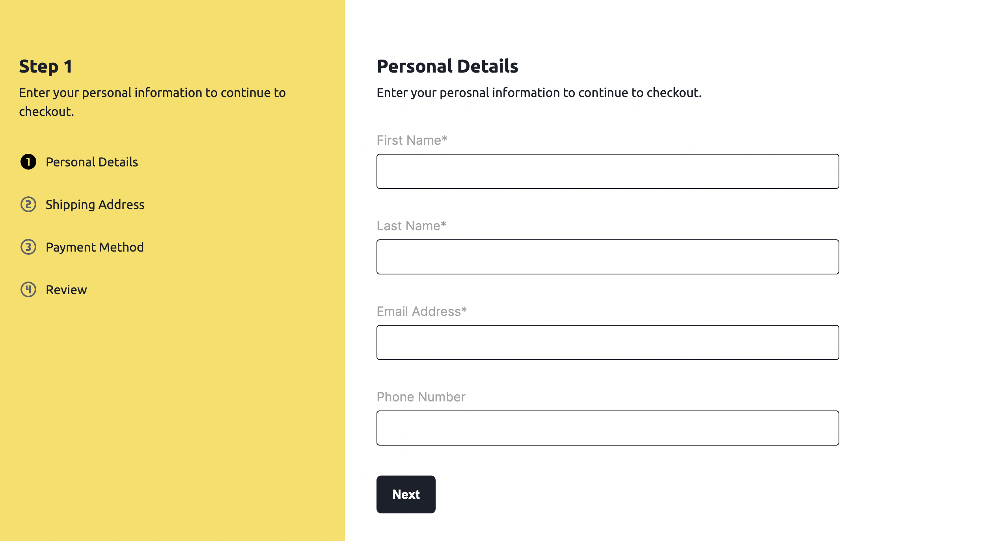

<div align="center">
  <h1>NestJs Multi-Step Form Using Formik</h1>
  <!-- Badges -->
<p>
  <a href="https://github.com/apettiigrew/nestjs-multi-step-form-with-formik/graphs/contributors">
    
  </a>
  <a href="">
    
  </a>
</p>
   
<h4>
    <a href="https://github.com/Louis3797/awesome-readme-template/">View Demo</a>
  <span> · </span>
    <a href="https://github.com/apettiigrew/nestjs-multi-step-form-with-formik/issues/">Request Feature</a>
  </h4>
</div>

<br />

<!-- About the Project -->

## :star2: About the Project

<!-- Screenshots -->

### :camera: Screenshots

<div align="center"> 


  <!--  -->
</div>


<!-- TechStack -->

### :space_invader: Tech Stack

<details>
  <ul>
    <li><a href="https://www.typescriptlang.org/">Typescript</a></li>
    <li><a href="https://nextjs.org/">Next.js</a></li>
    <li><a href="https://reactjs.org/">React.js</a></li>
    <li><a href="https://sass-lang.com/">Sass</a></li>
  </ul>
</details>

<!-- Env Variables -->


<!-- Getting Started -->

## :toolbox: Getting Started

<!-- Prerequisites -->

### :bangbang: Prerequisites
Install the following
- git
- nodejs

### :running: Run Locally

Clone the project
```bash
  git clone git@github.com:apettiigrew/nestjs-multi-step-form-with-formik.git
```

Go to the project directory

```bash
  cd nestjs-multi-step-form-with-formik
```

Install dependencies

```bash
  npm install
```

Start the server

```bash
  npm run dev
```
## :wave: Contributing

<a href="https://github.com/apettiigrew/nestjs-multi-step-form-with-formik/graphs/contributors">
  
</a>

Contributions are always welcome!

<!-- Acknowledgments -->

## :gem: Acknowledgements

Use this section to mention useful resources and libraries that you have used in your projects.

- [Shields.io](https://shields.io/)
- [Awesome README](https://github.com/matiassingers/awesome-readme)
- [Emoji Cheat Sheet](https://github.com/ikatyang/emoji-cheat-sheet/blob/master/README.md#travel--places)
- [Readme Template](https://github.com/othneildrew/Best-README-Template)
